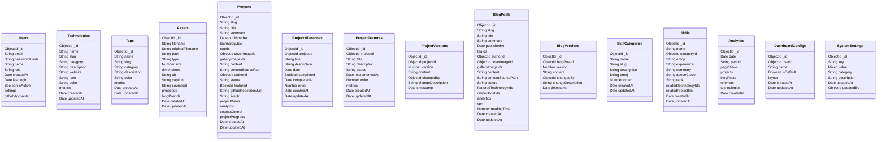

```mermaid
classDiagram
    class Users {
        ObjectId _id
        String email
        String passwordHash
        String name
        String role
        Date createdAt
        Date lastLogin
        Boolean isActive
        settings
        githubAccounts
    }
    class Technologies {
        ObjectId _id
        String name
        String slug
        String category
        String description
        String website
        String icon
        String color
        metrics
        Date createdAt
        Date updatedAt
    }
    class Tags {
        ObjectId _id
        String name
        String slug
        String category
        String description
        String color
        metrics
        Date createdAt
        Date updatedAt
    }
    class Assets {
        ObjectId _id
        String filename
        String originalFilename
        String path
        String type
        Number size
        dimensions
        String alt
        String caption
        String sourceUrl
        projectIds
        blogPostIds
        Date createdAt
        Date updatedAt
    }
    class Projects {
        ObjectId _id
        String slug
        String title
        String summary
        Date publishedAt
        technologyIds
        tagIds
        ObjectId coverImageId
        galleryImageIds
        String content
        String contentSourcePath
        ObjectId authorId
        String status
        Boolean featured
        String githubRepositoryUrl
        String liveUrl
        projectDates
        analytics
        sourceControl
        projectProgress
        Date createdAt
        Date updatedAt
    }
    class ProjectMilestones {
        ObjectId _id
        ObjectId projectId
        String title
        String description
        Date date
        Boolean completed
        Date completedAt
        Number order
        Date createdAt
        Date updatedAt
    }
    class ProjectFeatures {
        ObjectId _id
        ObjectId projectId
        String title
        String description
        String status
        Date implementedAt
        Number order
        metrics
        Date createdAt
        Date updatedAt
    }
    class ProjectVersions {
        ObjectId _id
        ObjectId projectId
        Number version
        String content
        ObjectId changedBy
        String changeDescription
        Date timestamp
    }
    class BlogPosts {
        ObjectId _id
        String slug
        String title
        String summary
        Date publishedAt
        tagIds
        ObjectId authorId
        ObjectId coverImageId
        galleryImageIds
        String content
        String contentSourcePath
        String status
        featuredTechnologyIds
        relatedPostIds
        analytics
        seo
        Number readingTime
        Date createdAt
        Date updatedAt
    }
    class BlogVersions {
        ObjectId _id
        ObjectId blogPostId
        Number version
        String content
        ObjectId changedBy
        String changeDescription
        Date timestamp
    }
    class SkillCategories {
        ObjectId _id
        String name
        String slug
        String description
        String emoji
        Number order
        Date createdAt
        Date updatedAt
    }
    class Skills {
        ObjectId _id
        String name
        ObjectId categoryId
        String emoji
        String experience
        String summary
        String aboveCurve
        String rank
        relatedTechnologyIds
        relatedProjectIds
        Date createdAt
        Date updatedAt
    }
    class Analytics {
        ObjectId _id
        Date date
        String period
        pageViews
        projects
        blogPosts
        referrers
        technologies
        Date createdAt
    }
    class DashboardConfigs {
        ObjectId _id
        ObjectId userId
        String name
        Boolean isDefault
        layout
        Date createdAt
        Date updatedAt
    }
    class SystemSettings {
        ObjectId _id
        String key
        Mixed value
        String category
        String description
        Date updatedAt
        ObjectId updatedBy
    }
```
